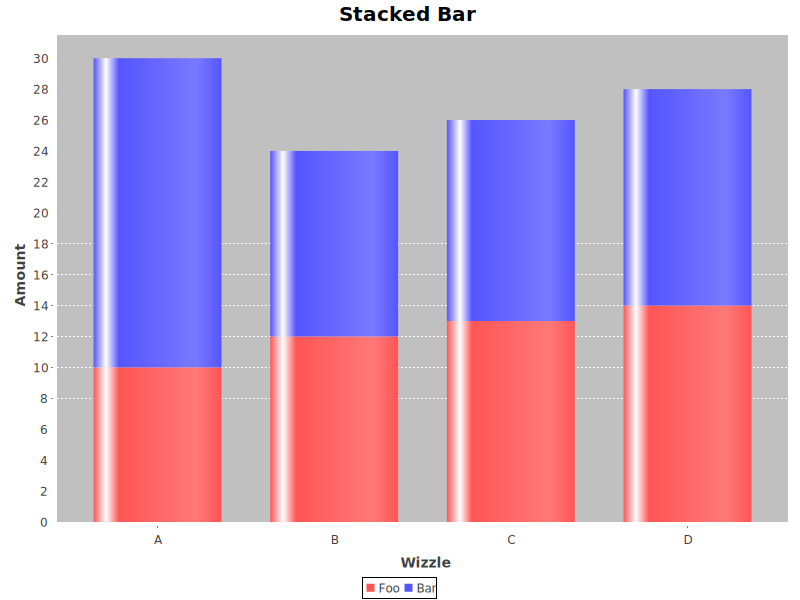

# scalaplot

Scalaplot is a small, type-oriented library for creating plots. It wraps [JFreeChart](http://www.jfree.org/jfreechart/)
in a (hopefully) nice API. It's intended for easily creating decent plots in REPL and notebook environments, and
supports [Apache Spark](https://spark.apache.org) out-of-the-box (don't worry - it's a `provided` dependency, so if you
don't use it, it won't affect you!)

Here's a quick example to give you an idea of how it's used:

```scala
Chart("Stacked Bar", StackedBar)
  .dataPoints(
    ("Foo", 10.0, 12.0, 13.0, 14.0),
    ("Bar", 20.0, 12.0, 13.0, 14.0))
  .domain("Wizzle", Categories)(_._1)
  .rangeAxis("Amount")
  .range("A")(_._2)
  .range("B")(_._3)
  .range("C")(_._4)
  .range("D")(_._5)
  .show()
```



There is a [whole page of examples](examples/), and documentation is forthcoming!

## TODO
[ ] Documentation!
[ ] Publish to Sonatype
[ ] More plots (some of these will be easy, others won't)
    [ ] Time series, Gantt, and waterfall plots (using `Date` and `java.time._` domains)
    [ ] Pie charts (I never use them, but it's obligatory!)
    [ ] 3D surface plots (not supported by JFreeChart, but we can add it here!)
    [ ] Bubble charts
    [ ] Density plots (density blocks are supported by JFC, but we can add better ones even)
    [ ] Candlestick / OLHC
[ ] Better stat plot API / aggregation API

## See Also

* [Vegas](https://www.vegas-viz.org) - a comprehensive plotting library using a JavaScript (vega-lite + D3) front-end
* [scala-chart](https://github.com/wookietreiber/scala-chart) - another Scala layer over JFreeChart, but with slightly different goals
* [scalaplot](https://github.com/sameersingh/scalaplot) - an XY-focused plotting library supporting multiple front-ends

## License

TBD. JFreeChart is LGPL3, JFreeSVG is GPL3. I'd like to do MIT or Apache, but I have to figure out if I'm allowed to
given the (binary, unpackaged) dependencies on JFree libraries.